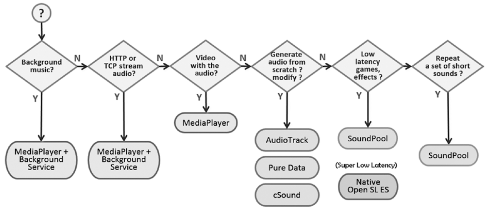

# ti.soundpool

Using `SoundPool` to play a short sound quickly on Android. Usefuly for "low latency":



> Image source: https://en.proft.me/2018/05/8/how-play-audio-file-android/

## Methods
* load(path)
* play(float:volume)

## Events
* ready

```js
var sp = require("ti.soundpool");
sp.init()
sp.load("./boing.ogg");
sp.addEventListener("ready", function() {
	console.log("ready");
	sp.play(1); // 1 = max. volume
})
```
